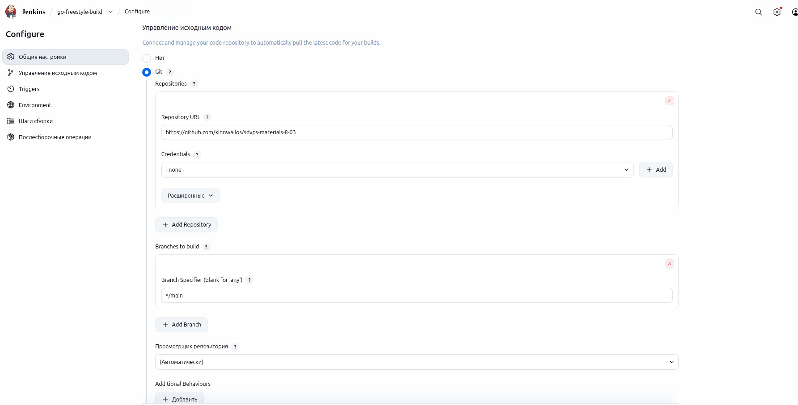
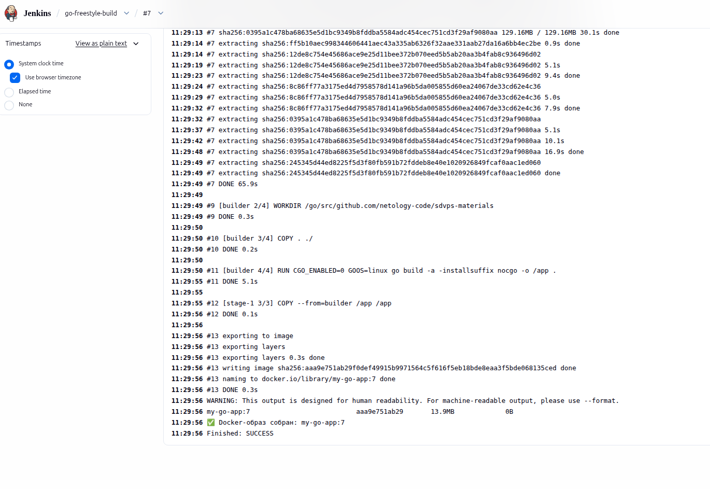
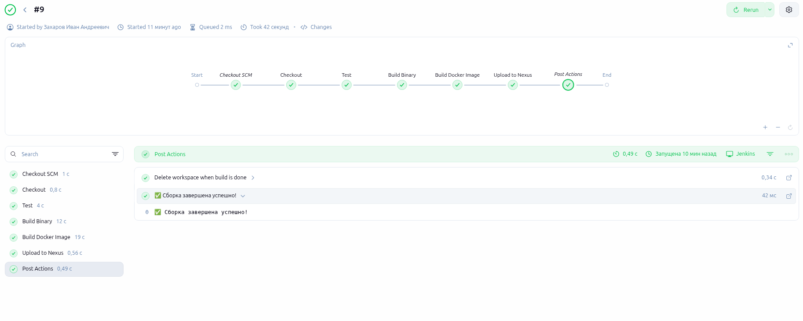
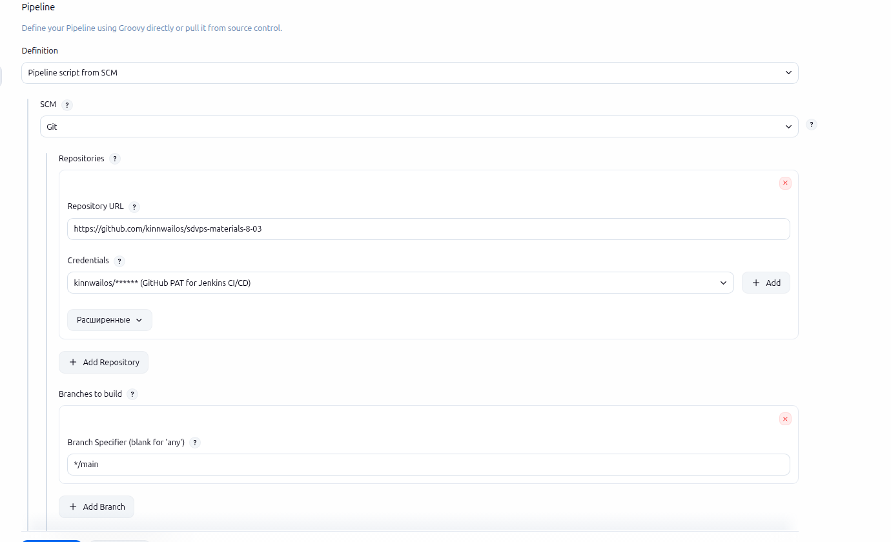
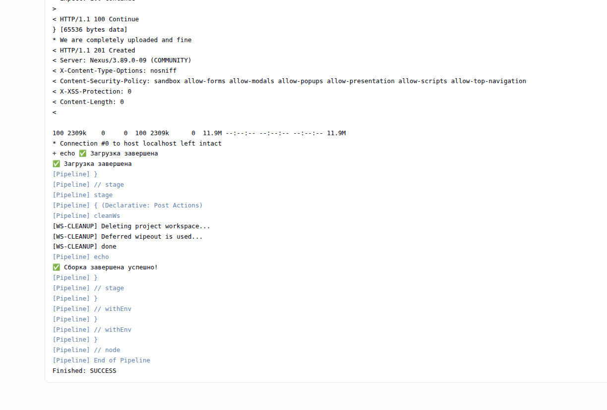
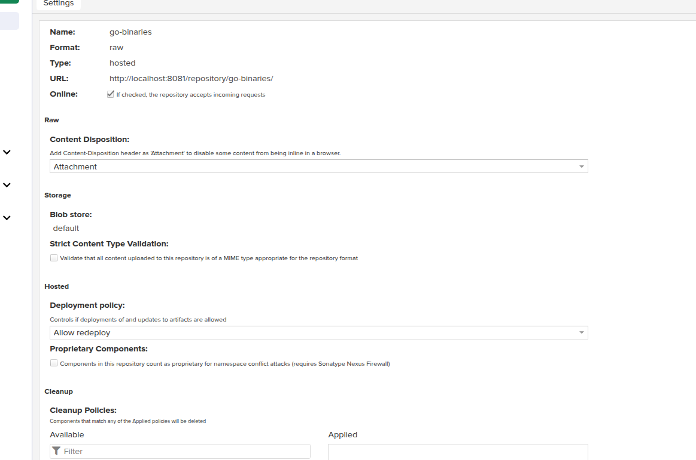
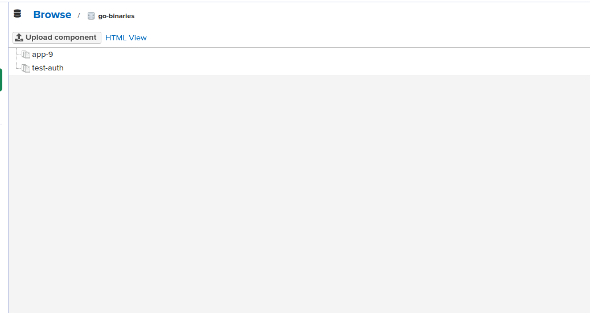
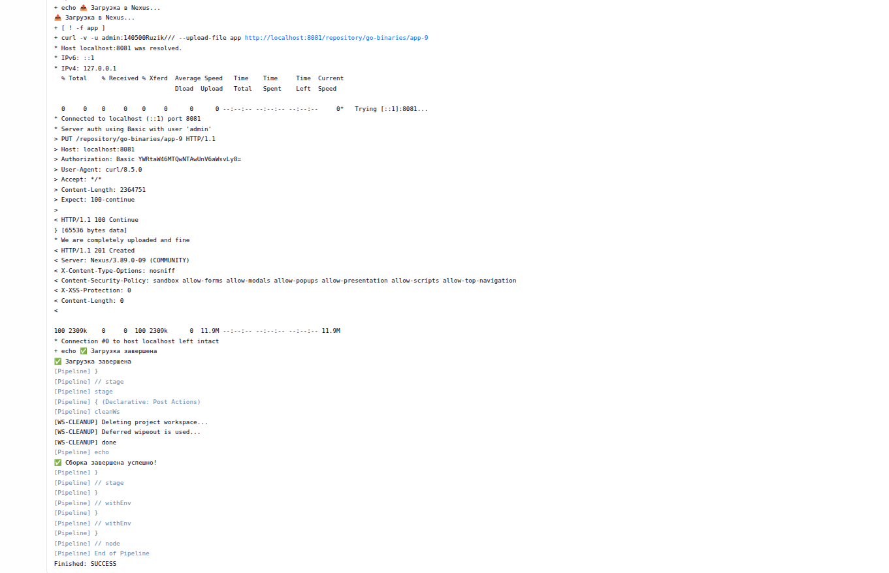

## Дополнительные материалы для выполнения домашних заданий из блока "Введение в DevOps"

- [Дополнительный материал для занятия "8.2. Что такое DevOps. СI/СD"](CICD/8.2-hw.md)

- [Дополнительный материал для занятия "8.3. GitLab"](https://github.com/netology-code/sdvps-materials/tree/main/gitlab)

Домашнее задание к занятию «Что такое DevOps. СI/СD»
Инструкция по выполнению домашнего задания
Сделайте fork репозитория c шаблоном решения к себе в GitHub и переименуйте его по названию или номеру занятия, например, https://github.com  /имя-вашего-репозитория/gitlab-hw или https://github.com  /имя-вашего-репозитория/8-03-hw.
Выполните клонирование этого репозитория к себе на ПК с помощью команды git clone.
Выполните домашнее задание и заполните у себя локально этот файл README.md:
впишите сверху название занятия, ваши фамилию и имя;
в каждом задании добавьте решение в требуемом виде — текст, код, скриншоты, ссылка.
для корректного добавления скриншотов используйте инструкцию «Как вставить скриншот в шаблон с решением»;
при оформлении используйте возможности языка разметки md. Коротко об этом можно посмотреть в инструкции по MarkDown.
После завершения работы над домашним заданием сделайте коммит git commit -m "comment" и отправьте его на GitHub git push origin.
Для проверки домашнего задания в личном кабинете прикрепите и отправьте ссылку на решение в виде md-файла в вашем GitHub.
Любые вопросы по выполнению заданий задавайте в разделе «Вопросы по заданию» в личном кабинете.
Желаем успехов в выполнении домашнего задания!

Задание 1
Что нужно сделать:

Установите себе jenkins по инструкции из лекции или любым другим способом из официальной документации. Использовать Docker в этом задании нежелательно.
Установите на машину с jenkins golang.
Используя свой аккаунт на GitHub, сделайте себе форк репозитория. В этом же репозитории находится дополнительный материал для выполнения ДЗ.
Создайте в jenkins Freestyle Project, подключите получившийся репозиторий к нему и произведите запуск тестов и сборку проекта go test . и docker build ..
В качестве ответа пришлите скриншоты с настройками проекта и результатами выполнения сборки.

Задание 2
Что нужно сделать:

Создайте новый проект pipeline.
Перепишите сборку из задания 1 на declarative в виде кода.
В качестве ответа пришлите скриншоты с настройками проекта и результатами выполнения сборки.

Задание 3
Что нужно сделать:

Установите на машину Nexus.
Создайте raw-hosted репозиторий.
Измените pipeline так, чтобы вместо Docker-образа собирался бинарный go-файл. Команду можно скопировать из Dockerfile.
Загрузите файл в репозиторий с помощью jenkins.
В качестве ответа пришлите скриншоты с настройками проекта и результатами выполнения сборки.

# Домашнее задание: Что такое DevOps. CI/CD

**ФИО**: Захаров Иван Андреевич
**Дата**: 08.03.2026

---

## Задание 1: Jenkins Freestyle Project
- Установлен Jenkins, настроен Freestyle Project
- Выполняются: `go test` + `docker build`

## Задание 2: Declarative Pipeline
- Создан Jenkinsfile с declarative syntax
- Stage: Checkout → Test → Build Binary → Docker → Upload

## Задание 3: Nexus + Upload
- Установлен Nexus 3.89.0, создан raw-hosted репозиторий `go-binaries`
- Pipeline загружает бинарник через curl с авторизацией

# trigger pipeline
