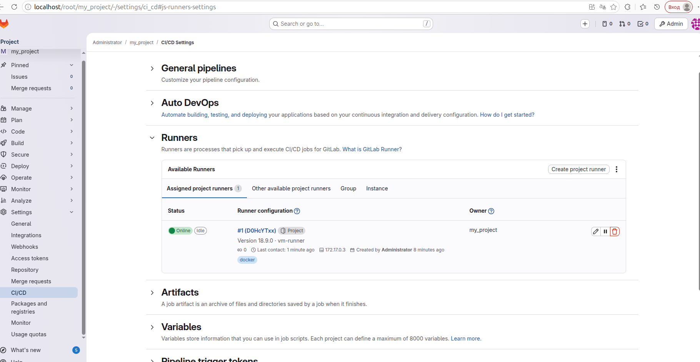
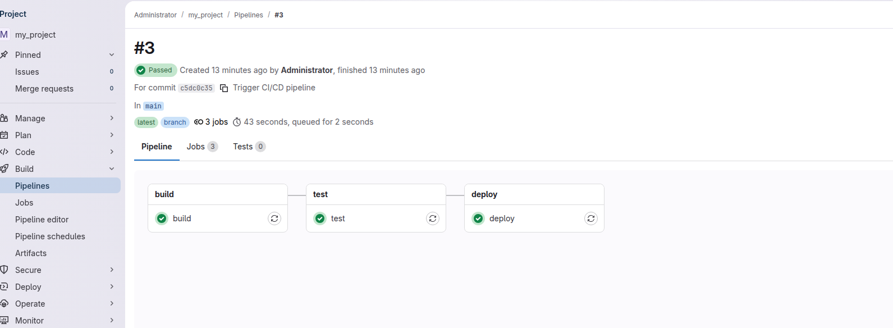

# GitLab Homework

**ФИО:** [Захаров Иван Андреевич]
**Занятие:** GitLab CI/CD
**Дата:** [13.03.2026]

---

## Задание 1: Развёртывание GitLab и Runner

### Конфигурация
- **GitLab**: Docker, образ `gitlab/gitlab-ce:latest`
- **Runner**: Docker executor, `gitlab/gitlab-runner:latest`
- **Сеть**: `--network host` для доступа к localhost
- **URL**: `http://localhost/`

### Скриншот настроек Runner

---

## Задание 2: Базовый .gitlab-ci.yml

### Файл .gitlab-ci.yml

[gitlab-ci.yml](.gitlab-ci.yml)

